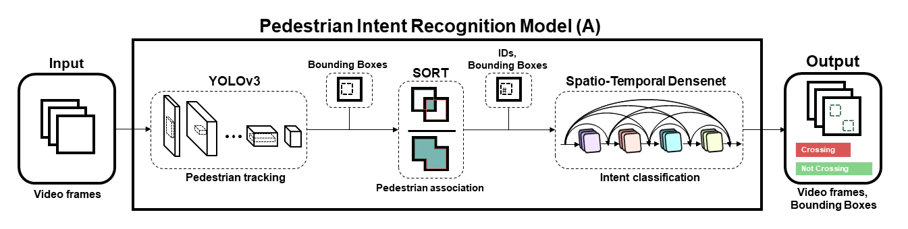
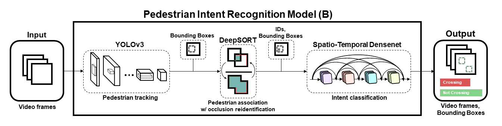
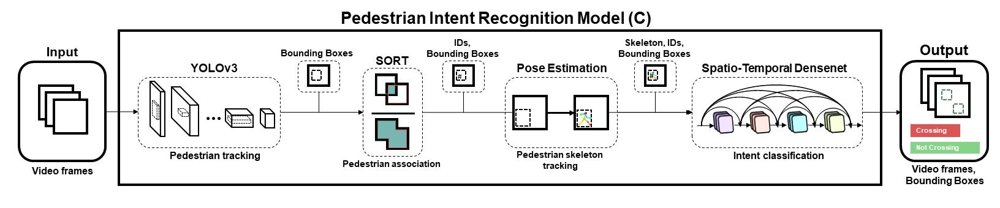
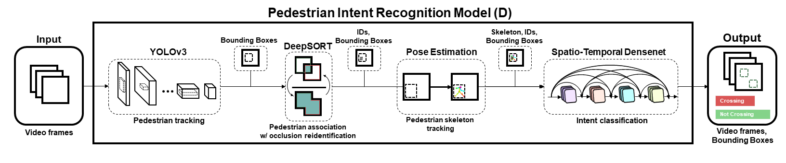

<p align='center'>
    
</p>

## Model Components
Our project involved building an integrated end-to-end system for pedestrian intent detection. A subset of the components are used for each model.
* **YOLOv3** -> Object detector: Responsible for identifying and detecting objects of interest in a given frame or image.
* **SORT** -> Object Tracker: Responsible for tracking the identified pedestrians for the sequence of frames and maintain unique IDs for each pedestrian.
* **DeepSORT** -> Object Tracker: Responsible for extracting features from the tracked pedestrian to enhance re-identification of the identified and tracked pedestrian even through occlusions.
* **Early Fused Skeleton** -> Skeleton mapping: Responsible for mapping skeletons for each tracked pedestrian.
* **Spatio-Temporal DenseNet** -> Classifier: Responsible for classifying every identified and tracked pedestrian's intention by using the last 16 frames of a pedetrian.


## Repo contents
* `/checkpoints` - Folder useful to hold weights and checkpoints
* `/data` - Consists file for class name
* `/deep_sort` - DeepSORT algorithm 
* `/images` - Images and GIFS for the README
* `/SORT` - Additional file for SORT
* `/tf-pose-estimation` - Skeleton fitting algorithm files
* `/yolov3_tf2` - Yolov3 algorithm files
* `/yolov3_tf2.egg-info` - Yolov3 additional files
* `.gitignore` - Ignore misc files like .DS_Store
* `densenet_1.hdf5` - Weights for ST-DenseNet that uses original images
* `densenet_2.hdf5` - Weights for ST-DenseNet that uses skeleton imposed images
* `densenet_model.json` - Saved ST-DenseNet Model file in json format
* `LICENSE` - MIT License for this repo
* `mars-small128.pb` - Protocol buffer weight file for DeepSORT
* `Model A.ipynb` - Google colab file for Model A demo
* `Model B.ipynb` - Google colab file for Model B demo
* `Model C.ipynb` - Google colab file for Model C demo
* `Model D.ipynb` - Google colab file for Model D demo
* `README.md` - Instructions on how to use this repo
* `sortn.py` - SORT algorithm

# Running the code
The code was developed and run on Google Colab (online iPython notebooks). Each model has its own Colab notebook. Follow each of the steps to configure and run the notebooks.
1. Click on the appropriate model's Colab button you wish to run. This will open a Colab notebook in your browser.
2. Ensure that you are in playground mode if you cannot edit the notebook. The following steps are included in each colab notebook but are repeated here as well.
3. Connect runtime to GPU for better/faster results. (Runtime --> Change runtime type --> GPU)
4. Clone the repository in a notebook cell.
```
!git clone https://github.com/NishilPatel99/pedestrian_intension
```
5. Install dependencies in a notebook cell.
```
%cd pedestrian_intension/tf-pose-estimation
! pip3 install -r requirements.txt
%cd tf_pose/pafprocess
! sudo apt install swig
!swig -python -c++ pafprocess.i && python3 setup.py build_ext --inplace
```
6. Add this Google Drive [folder](https://drive.google.com/drive/folders/1QzWZlR4FXJzR6nBT_ZL_k7ruzCep_CjK?usp=sharing) of weight files as a shortcut My Drive (Click the bar that says `additional_files` as the folder name at the top and click **Add shortcut to Drive**)
7. Run the rest of the notebook cells (**Shift + Enter**) following further directions specific to each model and observe the output

## Model A

Model A uses the following components:
1. YOLO - `./yolov3_tf2`
2. SORT - `sortn.py`
3. DenseNET - `densenet_model.json`

### Click here to test Model A: [](https://colab.research.google.com/drive/1nE3lBWkxDDZcqYlfKMuba1S1yjnjkfoO)

## Model B

Model A uses the following components:
1. YOLO - `./yolov3_tf2`
2. DeepSORT - `./deep_sort`
3. DenseNET - `densenet_model.json`

### Click here to test Model B: [](https://colab.research.google.com/drive/176zO5iqg5JsWX7daWx0Wi8wb9cgkPRuF)

## Model C

Model A uses the following components:
1. YOLO - `./yolov3_tf2`
2. SORT - `sortn.py`
3. Skeleton - `./tf-pose-estimation`
4. DenseNET - `densenet_model.json`

### Click here to test Model C: [](https://colab.research.google.com/drive/1p4q1ltgxKfQ7n6e4ERgc56lMjo20pcaA)

## Model D

Model A uses the following components:
1. YOLO - `./yolov3_tf2`
2. DeepSORT - `./deep_sort`
3. Skeleton - `./tf-pose-estimation`
4. DenseNET - `densenet_model.json`

### Click here to test Model D: [](https://colab.research.google.com/drive/1npRWOWVSQ6-8WxjC_zkhCT_kPDL_QDAW)


